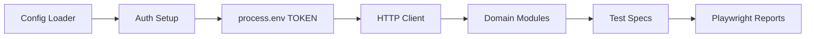

# Playwright E2E Framework (TypeScript)


Reusable TypeScript Playwright framework for scalable API/UI testing in CI/CD pipelines.

## Why This Looks Senior

- Modular domain architecture (`modules/*`) for long-term maintainability
- Shared auth/bootstrap setup with reusable HTTP/test utilities
- Environment-driven configuration and token handling
- Framework-first approach for team scale, not single-script testing

## Architecture



## Test Strategy

- **Contract/API checks:** Fast backend signal before UI layers.
- **Workflow/UI checks:** User-centric critical paths.
- **Layered reliability:** Shared setup, reusable fixtures, deterministic config.
- **CI-ready quality gate:** Parallel execution + artifact reporting.
- **Security hygiene:** API keys/tokens loaded from config/env, never hardcoded.

## Project Structure

```text
playwright-e2e-tests/
├── modules/
├── utils/
├── tests/
├── config.example.yaml
├── playwright.config.ts
└── package.json
```

## Setup

```bash
npm install
npx playwright install
cp config.example.yaml config.yaml
```

## Run

```bash
npx playwright test
npx playwright test --headed
```

## Security Notes

- Keep `config.yaml` local/private.
- Use CI secret variables for API keys and credentials.
- Never commit runtime tokens.
